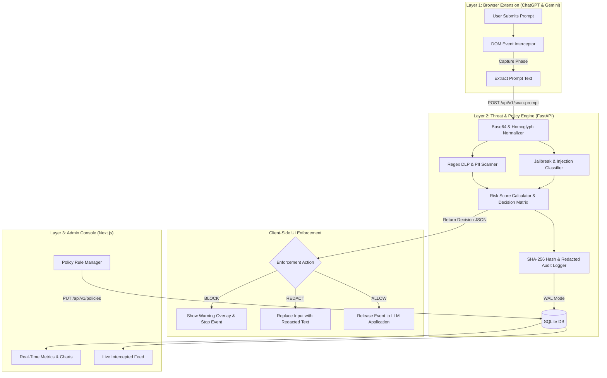

# ASIPE — AI Security Interceptor & Policy Engine

> **Real-time endpoint DLP, prompt injection defense, and security governance platform for enterprise LLM interactions.**

---

## 🛡️ Executive Summary

**ASIPE (AI Security Interceptor & Policy Engine)** is an enterprise AI security platform designed to prevent data leaks (DLP), block prompt injections/jailbreaks, and enforce compliance policies when users interact with web-based LLM applications (such as ChatGPT and Gemini).

ASIPE operates via a 3-layer security model:
1. **Layer 1: Browser Extension (Client-Side Interceptor)** — Hooks into DOM input elements at the capture phase (`useCapture: true`) to halt unsafe prompt submissions *before* network transmission occurs.
2. **Layer 2: Central Threat & Policy Engine (Backend API)** — Synchronously evaluates prompt payloads for PII, API keys/secrets, and jailbreaks, calculating a composite risk score (0–100) and returning enforcement decisions (`ALLOW`, `REDACT`, `BLOCK`).
3. **Layer 3: Admin & Governance Console (Web Dashboard)** — Provides real-time threat analytics, live security event feeds, interactive policy configuration, and compliance audit exports (SOC2, GDPR, HIPAA).

---

## 📐 System Architecture & Data Flow



---

## ✨ Key Features & Technical Highlights

- ⚡ **Pre-Flight DOM Capture**: Intercepts `Enter` keypresses and send button clicks using `useCapture: true` and `event.stopImmediatePropagation()`, halting network dispatches locally before LLM API serializations.
- 🔄 **SPA Resilience**: Implements `MutationObserver` to maintain listener bindings across dynamic React and Angular DOM tree updates on ChatGPT and Gemini.
- 🧹 **Text Normalization**: Decodes embedded Base64 strings and cleans Unicode homoglyphs prior to executing DLP scanning logic.
- 🔑 **DLP & Secret Detection**: Scans for Credit Card / PAN numbers, Social Security Numbers (SSN), Email addresses, AWS Access Keys, OpenAI API Keys, and RSA Private Keys.
- 🚨 **Prompt Injection Defense**: Detects System Prompt Extraction attempts, DAN (Do Anything Now) jailbreaks, Developer Mode overrides, and malicious roleplay instructions.
- 🔒 **Data Privacy & Honeypot Prevention**: Computes SHA-256 hashes for prompt tracking and redacts sensitive PII prior to database persistence, preventing `audit_logs` from becoming a security honeypot.
- 📈 **Governance Dashboard**: Next.js portal providing real-time telemetry, action breakdowns, rule toggles, risk sliders, and downloadable CSV compliance reports.

---

## 📂 Project Directory Structure

```text
PromptShield/
├── backend/                         # Layer 2: FastAPI Threat & Policy Engine
│   ├── main.py                      # FastAPI entrypoint with CORS configuration
│   ├── config.py                    # Settings, risk thresholds, API keys
│   ├── database.py                  # SQLite WAL mode connection engine
│   ├── models/
│   │   ├── db_models.py             # SQLAlchemy ORM models (AuditLog, SecurityPolicy)
│   │   └── schemas.py               # Pydantic DTOs & validation schemas
│   ├── services/
│   │   ├── dlp_scanner.py           # Regex PII & API Key scanner with text normalizer
│   │   ├── injection_classifier.py  # Jailbreak & injection detector
│   │   ├── risk_engine.py           # Risk score (0-100) calculator & decision matrix
│   │   └── audit_logger.py          # SHA-256 hashed audit log service
│   ├── routes/
│   │   ├── scan.py                  # POST /api/v1/scan-prompt endpoint
│   │   ├── policies.py              # GET & PUT /api/v1/policies endpoints
│   │   └── logs.py                  # GET /api/v1/logs & export endpoints
│   ├── tests/
│   │   └── test_scan.py             # Pytest automated unit test suite
│   └── requirements.txt             # Python dependencies
├── extension/                       # Layer 1: Manifest V3 Browser Extension
│   ├── manifest.json                # MV3 extension configuration
│   ├── background.js                # Service Worker handling storage & API fetch
│   ├── dom_interceptor.js           # Event capture & MutationObserver script
│   ├── ui_modal.js                  # In-browser warning modal UI
│   ├── content.js                   # Main content script coordinator
│   ├── styles.css                   # Warning overlay styles
│   ├── popup.html                   # Extension popup interface
│   └── popup.js                     # Popup status handler
└── dashboard/                       # Layer 3: Next.js Admin Governance Console
    ├── package.json                 # Next.js workspace & UI dependencies
    ├── next.config.js               # Next.js configuration
    └── src/
        ├── app/
        │   ├── layout.js            # Global portal layout shell
        │   ├── page.js              # Executive Overview page
        │   ├── logs/page.js         # Security audit log inspection page
        │   └── policies/page.js     # Policy manager page
        ├── components/
        │   ├── Navbar.js            # Top navigation header
        │   ├── ThreatFeed.js        # Real-time event log stream table
        │   ├── RiskCharts.js        # Analytics visualization widget
        │   ├── PolicyToggle.js      # Rule toggle & risk score slider widget
        │   └── ExportModal.js       # Compliance CSV export dialog
        └── lib/
            └── api.js               # API service client
```

---

## 🚀 Quickstart Guide

### Prerequisites
- **Python 3.10+**
- **Node.js 18+** & `npm`
- **Google Chrome** or **Microsoft Edge** browser

---

### 1. Launch Backend API Engine (Layer 2)

```bash
# Navigate to project root
cd PromptShield

# Install backend dependencies
pip install -r backend/requirements.txt

# Launch FastAPI server
python -m uvicorn backend.main:app --reload --port 8000
```
> The API server will start at `http://127.0.0.1:8000`. Interactive API documentation is available at `http://127.0.0.1:8000/docs`.

---

### 2. Install Browser Extension (Layer 1)

1. Open Chrome or Edge and navigate to `chrome://extensions`.
2. Toggle **Developer mode** ON (top right corner).
3. Click **Load unpacked** (top left).
4. Select the directory `PromptShield/extension`.
5. Open [ChatGPT](https://chatgpt.com) or [Gemini](https://gemini.google.com). You will see the **🛡️ ASIPE Active** indicator in the bottom right corner.

---

### 3. Launch Admin Governance Dashboard (Layer 3)

```bash
# Navigate to dashboard directory
cd PromptShield/dashboard

# Install npm dependencies
npm install

# Start Next.js development server
npm run dev
```
> Open `http://localhost:3000` in your browser to access the Admin Console.

---

## 🧪 Running Unit Tests

Run the automated test suite covering DLP detection, jailbreak classification, risk scoring, and header authentication:

```bash
pytest backend/tests/test_scan.py
```

---

## ⚠️ Security Boundary Notice

> [!NOTE]
> The browser extension functions as an endpoint UX agent and security nudge. Technical users can potentially bypass browser extensions via DevTools, direct API calls, or Incognito mode. For enterprise-grade unbypassable DLP enforcement, ASIPE should be paired with a network-level Forward Proxy or Cloud Access Security Broker (CASB).
